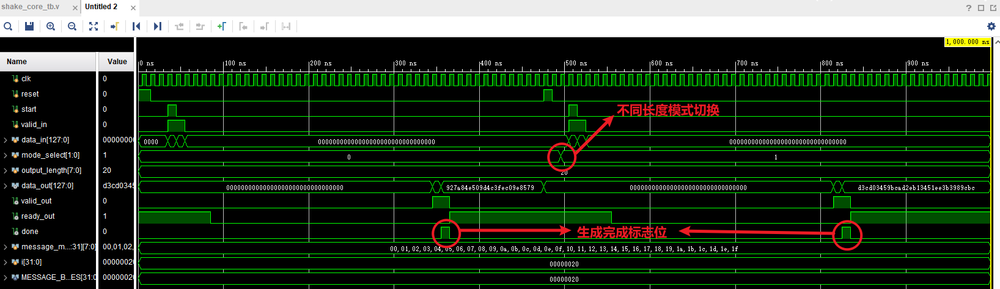
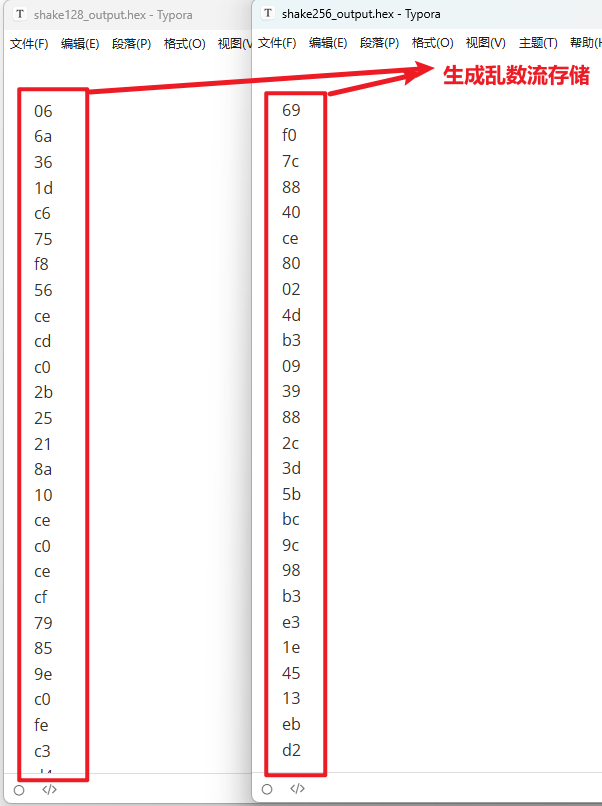
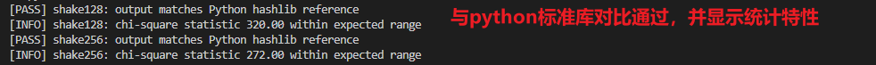
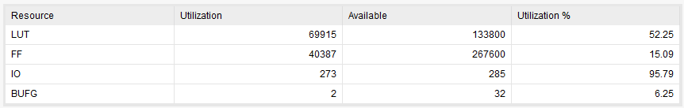

# SHAKE 核心硬件设计说明

Time:2025/09/11/09:22

Author: HaoWang 

## 模块概述

`shake_core` 模块实现了面向 SHAKE-128 与 SHAKE-256 的硬件内核，基于 Keccak-f[1600] 置换。模块提供 128 位输入/输出数据路径，配合 `start`/`valid_in`/`ready_out` 握手信号完成吸收阶段，在内部完成填充和置换操作，并通过 `valid_out` 输出伪随机字节流。

核心特性：

- **多模式支持**：`mode_select=0` 对应 SHAKE-128，`mode_select=1` 对应 SHAKE-256。自动配置比特率（168/136 字节）。
- **流水线置换**：实现 24 级流水线的 `keccak_permutation`，每级执行一次 Keccak round，满足高频率运行需求。
- **阶段并行**：吸收阶段与挤出阶段通过状态机协调，置换阶段单独排队，支持多轮挤出。
- **输出控制**：通过 `output_length` 配置输出字节数，模块在达到目标长度后拉高 `done`。

## 内部结构

### 状态机

- `STATE_IDLE`：等待 `start`，初始化状态。
- `STATE_ABSORB`：接收输入数据并异或至 Keccak 状态。当前参考测试使用每周期 16 字节数据，数据需连续提供。
- `STATE_WAIT_PERM`：等待 Keccak 置换流水线完成。
- `STATE_SQUEEZE`：根据 `output_length` 挤出数据，每周期最多输出 16 字节。若输出长度超过单轮比特率，自动发起下一轮置换。

### 填充

吸收阶段结束后按照 SHAKE 规范执行 `0x1F`/`0x80` 填充。当前测试场景中消息长度小于比特率，若需要跨多轮吸收，可在上层调度中补齐数据块或扩展状态机。

### 置换流水线

`keccak_permutation` 将 24 个 `keccak_round` 级联，每一级包含 θ、ρ、π、χ、ι 操作并在输出端寄存。流水线握手信号保证一次置换在 24 个时钟之后给出结果，使核心能够在较高频率下运行。

## 使用方法

1. 复位后拉高 `start` 并开始输入数据，`valid_in` 在有数据时保持为 1。当前实现假设每周期输入 16 字节。
2. 当输入结束时将 `valid_in` 拉低，模块自动执行填充与置换。
3. `valid_out` 高电平表示输出有效，外部根据 `output_length` 截取所需字节。
4. 当输出长度满足配置时，`done` 拉高一个时钟周期，同时 `ready_out` 返回高电平。

## 仿真与验证







- `0.SHAKE/test/shake_core_tb.v`：基于 32 字节测试向量的 testbench，分别验证 SHAKE-128 与 SHAKE-256。
- `0.SHAKE/test/shake_golden.py`：使用 Python `hashlib` 作为黄金模型比较仿真输出，并计算卡方统计量评估随机性。

运行步骤：

```bash
iverilog -g2012 -o shake_core_tb 0.SHAKE/shake_core.v 0.SHAKE/test/shake_core_tb.v
vvp shake_core_tb
python3 0.SHAKE/test/shake_golden.py
```

通过上述流程可验证硬件实现与软件模型一致，并进行基础的统计检验。

## Synthesis与Implementation

基于**Xilinx Artix-7** 系列**,xc7a200tfbg484-2**芯片。**default**策略



可见，因采用24级流水展开，资源开销巨大。

Imple阶段预计耗费一小时，暂时得不到结果是正常的。
