[TOC]
# CRYSTALS-kyber 算法梳理
'''
@Descripttion: CRYSTALS-kyber 算法梳理
@version: V1.0
@Author: HZW
@Date: 2025-03-07 19:21:00
'''
## 简介
* 本文档旨在梳理ML_KEM算法的数据流变化;
* 阅读时，简要阅读1.辅助函数章节，重点关注3.K_PKE;
* 如果只关注算法流程，可以跳过2.快速数论变换（NTT）的原理推导部分;
* 在阅读3.K_PKE时，可以不用关注NTT,INTT以及辅助函数的具体实现;
* 重点关注数据位宽的变化;
  
## 1.辅助函数
***
### (1)BitsToBytes(b)
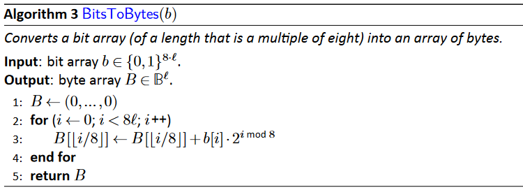
* 功能：比特数组转字节数组
* b这里为小端存储，比如 `$11010001=2^0+2^1+2^3+2^7=139$`  

***
### (2)BytesToBits(B)
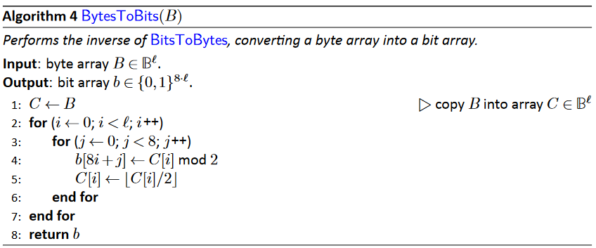
* 功能:字节数组转比特数组
* b这里为小端存储，比如 `$11010001=2^0+2^1+2^3+2^7=139$`  

***
### (3)sampleNTT(B)
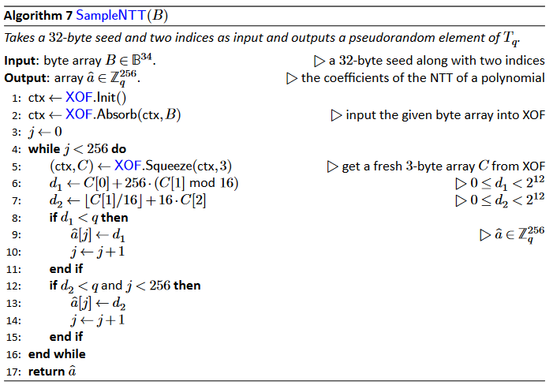
* 功能：均匀采样，在其他版本中为Parse
* 输入：B，34字节，其中32字节的seed加两个字节的索引
* 输出: `$\hat a \in Z_q^{256}$`
***

### (4)sampleCBD(B)
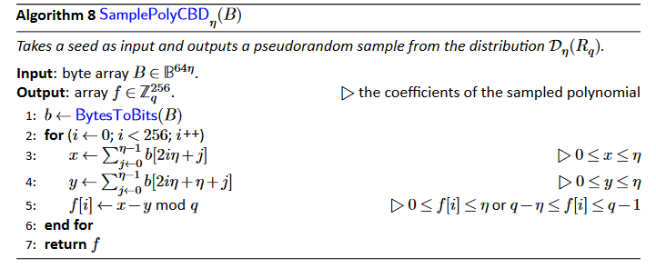
* 功能：中心二项分布采样，在其他版本中为CBD
* 输入：`$B^{64\eta}$`，`$64\eta$`字节的种子，其中`$\eta  \in \{ 2,3\} $`
* 输出: `$f \in Z_q^{256}$`
* 1： b是一个`$512\eta $`长度的bit数组

***
### (5)ByteEncode(B)（编码函数）
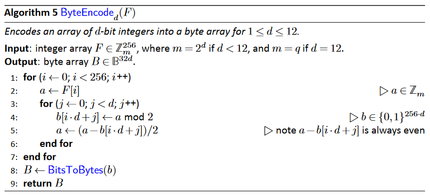
* 功能：将一个长度为256的整数数组转换为长度32d的字节数组，其中整数数组的元素为d bit大小
* 输入：`$\pmb F  \in \Z_m^{256} $`，其中`$m=2^d,1\le d < 12 $`,and `$m=q$` if `$d=12$`。
* 输出: B为长度32d的字节数组
* 长度变换为：`$256 \times d=32 \times d \times 8 $`
***

### (6)ByteDecode(B)（解码函数，序列反序化）
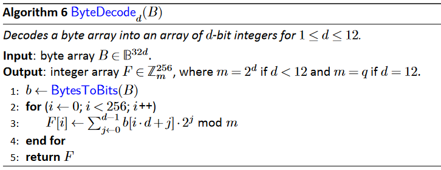
  * 功能：将一个长度为32d的字节数组转换为整数数组，其中整数数组的元素为d bit大小
  * 长度变换为：`$32 \times d \times 8=256 \times d $`

***
### (7)compress and Decompress
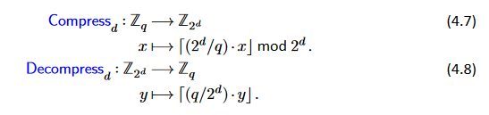
* 功能：compress用于舍弃密文中一些对解密正确性影响不大的低比特位，从而减小密文大小。Decompress为其逆过程。
***
## 2.快速数论变换(NTT)
### (1)NTT的数学结构
#### 1）NTT的原理
对于`$n=256，q=3329$`时，在`$Z_q$`上只有256次单位根，即`${\zeta ^{256}}\bmod q = {\zeta ^{256}}\bmod 3329 = 1 $`，其中`$\zeta =17$`时256次单位根。因此有
```math
\begin{equation}
    \begin{split}
      {\zeta ^{256}} = ({\zeta ^{128}})^2 \equiv 1 \bmod q  \Rightarrow  {\zeta ^{128}} \equiv -1 \bmod q 
    \end{split}
\end{equation}
```
则：
```math
\begin{equation}
    \begin{split}
    X^{256}+1&=(X^{256}-{\zeta ^{128}}) \\
    &=\prod\limits_{i = 0}^{127} {( X^2-{\zeta ^{2i+1}})}\\
    &=\prod\limits_{i = 0}^{127} {(X^2-{\zeta ^{2 \mathrm {BitRev_7}{(i)}+1}})}\bmod q
    \end{split}
\end{equation}
```
其中`$\mathrm {BitRev_7}(r)$`作用是将7bit无符号数的bit位顺序反转，即`$\mathrm {BitRev_7}(r)=\mathrm {BitRev_7}(r_02^0+r_12^1+\dots r_62^6)=r_62^0+r_52^1+\dots r_02^6$`。因此，多项式环`${R_q} = {\Z_q}[X]/({X^{256}} + 1)$`同构于128个2次扩展的直和，即`${T_q} =\bigoplus\limits_{i=1}^n {\Z_q[X]/(X^2-{\zeta ^{2 \rm {BitRev_7}{(i)}+1}})}$`.

多项式`$f = \sum\limits_{i = 0}^{255} {{f_i}} {x^i}$`的NTT形式为：
```math
\begin{equation}
    \begin{split}
    \hat f = \mathrm{NTT}(f) = {\hat f_0} + {\hat f_1}X +  \cdots {\hat f_{255}}{X^{255}}
    \end{split}
\end{equation}
```
注意上述代数结构`$\mathrm {NTT}(f)$`不具有任何数学意义。基于环上中国剩余定理，即多项式环`$R_q \to T_q$`的同构映射。实际`$\mathrm {NTT}(f)$`的各个系数可以表示为以下128个1次剩余多项式组成的向量:
```math
\begin{equation}
    \begin{split}
      \hat f &= \mathrm {NTT}(f) \\
      &= (f\bmod X^2-{\zeta ^{2 \mathrm{BitRev_7}(0)+1}},\dots,f\bmod X^2-{\zeta ^{2 \mathrm {BitRev_7}(127)+1}})\\
      &=({\hat f_0} + {\hat f_1}X,{\hat f_2} + {\hat f_3}X,\dots,{\hat f_{254}} + {\hat f_{255}}X) \\
      &=(F_0,F_1,\dots,F_{127})
    \end{split}
\end{equation}
```
证明以下过程：`$ f\bmod X^2-{\zeta ^{2 \mathrm{BitRev_7}(i)+1}} \Rightarrow {\hat f_{2i}} + {\hat f_{2i+1}}X $`
因为：`$X^2 \equiv {\zeta ^{2 \mathrm{BitRev_7}(i)+1}} \bmod X^2-{\zeta ^{2 \mathrm{BitRev_7}(i)+1}}$`
```math
\begin{equation}
    \begin{split}
      f\bmod X^2-{\zeta ^{2 \mathrm{BitRev_7}(i)+1}} &=\sum\limits_{i = 0}^{255} {{f_i}} {x^i}\bmod X^2-{\zeta ^{2 \mathrm{BitRev_7}(i)+1}} \\
      &=(\sum\limits_{j = 0}^{127} {{f_{2j}}} {x^{2j}}+\sum\limits_{j = 0}^{127} {{f_{2j+1}}} {x^{2j+1}})\bmod X^2-{\zeta ^{2 
      \mathrm{BitRev_7}(i)+1}} \\
      &=(\sum\limits_{j = 0}^{127} {{f_{2j}}} {{\zeta ^{(2 
      \mathrm{BitRev_7}(i)+1)j}}}+X\sum\limits_{j = 0}^{127} {{f_{2j+1}}} {{\zeta ^{(2 \mathrm{BitRev_7}(i)+1)j}}})\bmod X^2-{\zeta ^{2 \mathrm{BitRev_7}(i)+1}}
    \end{split}
\end{equation}
```
令：
```math
\begin{equation}
    \begin{split}
      &\hat f_{2i}
      =\sum\limits_{j = 0}^{127} {{f_{2j}}} {{\zeta ^{(2 
      \mathrm{BitRev_7}(i)+1)j}}} \\
      &\hat f_{2i+1}
      =\sum\limits_{j = 0}^{127} {{f_{2j+1}}} {{\zeta ^{(2 
      \mathrm{BitRev_7}(i)+1)j}}}
    \end{split}
\end{equation}
```
因此，`$ f\bmod X^2-{\zeta ^{2 \mathrm{BitRev_7}(i)+1}} = {\hat f_{2i}} + {\hat f_{2i+1}}X $`
**实际上NTT算法的核心就是利用单位根的对称性加速式（6）的计算**
***
#### 2）PWM逐点乘法，符号记作`$\circ$`
对于多项式乘法`$h(x)=f(x)\cdot g(x)\bmod x^n+1$`，其中`$h(x)$`的NTT向量形式为`$(H_0,H_1,\dots,H_{127})$`，`$g(x)$`的NTT向量形式为`$(G_0,G_1,\dots,G_{127})$`
则多项式乘积的NTT系数向量为：

```math
\begin{equation}
    \begin{split}
        (H_0,H_1,\dots,H_{127}) &= (F_0,F_1,\dots,F_{127})\circ (G_0,G_1,\dots,G_{127})\\
        &=(F_0\cdot G_0\bmod X^2-{\zeta ^{2 \mathrm{BitRev_7}(0)+1}},\dots,F_{127}\cdot G_{127}\bmod X^2-{\zeta ^{2 \mathrm{BitRev_7}(127)+1}})
    \end{split}
\end{equation}
```
对于`$H_i$`有:
```math
\begin{equation}
    \begin{split}
      H_i&=F_{i}\cdot G_{i}\bmod X^2-{\zeta ^{2 \mathrm{BitRev_7}(i)+1}}\\
         &=(\hat f_{2i}+X\hat f_{2i+1})\cdot (\hat g_{2i}+X\hat g_{2i+1})\bmod X^2-{\zeta ^{2 \mathrm{BitRev_7}(i)+1}}\\
         &=(\hat f_{2i}\hat g_{2i}+X^2\hat f_{2i+1}\hat g_{2i+1}+X\hat f_{2i}\hat g_{2i+1}+X\hat f_{2i+1}\hat g_{2i})\bmod X^2-{\zeta ^{2 \mathrm{BitRev_7}(i)+1}} \\
         &=(\hat f_{2i}\hat g_{2i}+\hat f_{2i+1}\hat g_{2i+1}{\zeta ^{2 \mathrm{BitRev_7}(i)+1}}+X(\hat f_{2i}\hat g_{2i+1}+\hat f_{2i+1}\hat g_{2i}))\bmod X^2-{\zeta ^{2 \mathrm{BitRev_7}(i)+1}}
    \end{split}
\end{equation}
```

***
### (2) 伪代码
#### 1）NTT
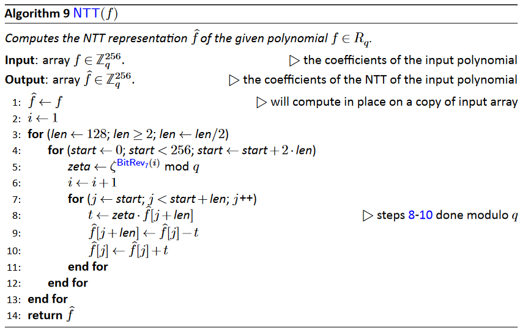
* 功能：将`$R_q$`上的多项式系数转换为`$T_q$`上的多项式系数
* 输入：长度为256的系数向量，元素大小为12bit(在q=3329时)
* 输出：长度为256的系数向量，元素大小为12bit(在q=3329时)
* 核心功能：
  * 这例算法给出的是原位NTT，即本地读写方式，不会产生额外的内存。
  * 并且核心过程采用的cooley-Tukey(CT)蝶形运算，又称为时域抽取（DIT），如下图所示。对于应8-10行。
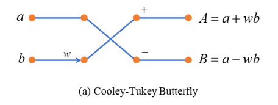
* 以16点NTT为例解释伪代码
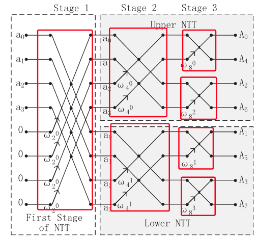
* 第一个for循环控制stage数，伪代码中需要7次
* 第二个for循环根据旋转因子进行分区，如图中红色框标记。
* 第三个for循环对块内执行时域抽取

*** 
#### 2）INTT
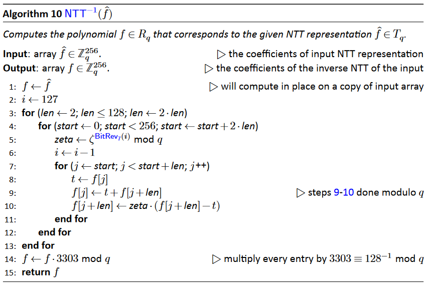
* 功能：该过程为NTT的逆过程
* 核心功能：
  * 这例算法给出的是原位INTT，即本地读写方式，不会产生额外的内存。
  * 并且核心过程采用的Gentleman-Sande(GS)蝶形运算，又称为频域抽取（DIF），如下图所示。对于应8-10行。
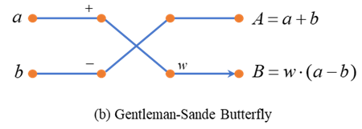

***
#### 3）PWM
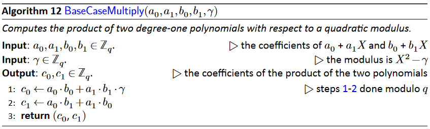
* 功能:计算式(8)
* 输入:12bit的`$a_0,a_1,b_0,b_1$`，以及本源根`$\gamma$`
* 输出:12bit的`$c_0,c_1$`
  
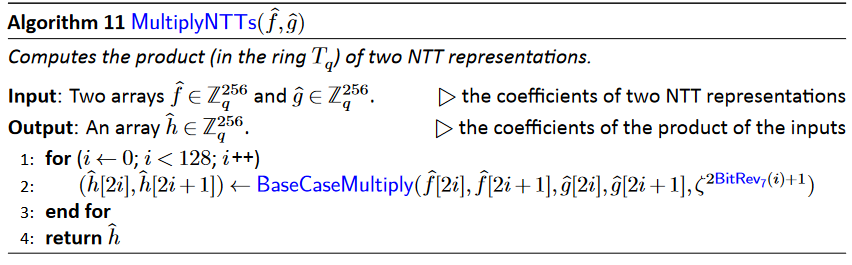
* 功能：执行式（7）的逐点乘
 
***
## 3.K_PKE组件方案
### (1)k-PKE.KeyGen密钥生成算法
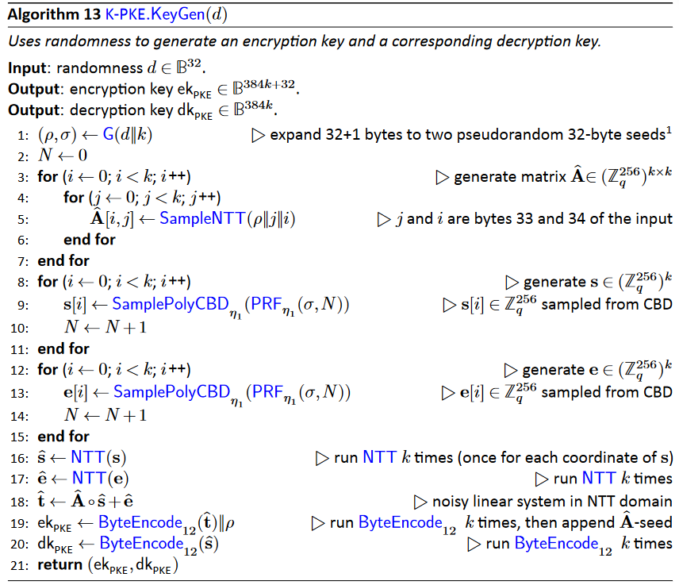
* 输入：d,32字节
* 输出: 加密密钥`$ek_{\rm{PKE}}\in B^{384k+32}$`，长度为384k+32字节
* 输出: 解密密钥`$dk_{\rm{PKE}}\in B^{384k}$` ，长度为384k字节
* 1:(a,b)=G(d||k)=SHA3-512(d||k)，即将32+1个字节扩展为两个32字节的随机种子，其中SHA3-512为哈希标准函数
* 2-7：重复调用sampleNTT生成多项式矩阵的NTT形式`$\hat{\pmb A} \in (Z_q^{256})^{k\times k}$`，其中`$\rho \parallel j\parallel i$`将`$\rho $`，j和i拼接成34字节
* 8-15: 重复调用`$\rm sampleCBD_{\eta_1}$`生成多项式向量`$\pmb s,\pmb e\in (Z_q^{256})^k$`。其中PRF通过调用`${\rm SHAKE256}(\sigma \parallel N,8 \cdot 64 \cdot \eta_1)$`生成`$ 64\eta_1$`字节长度的种子。然后灌入`$\rm sampleCBD_{\eta_1}$`生成多项式系数。其中SHAKE256为kaccak-f标准函数
* 16-18: 对多项式向量`$\pmb s,\pmb e$`执行NTT变换，以及执行NTT形式的多项式点乘（需要注意的是这里元素间的乘法是逐点乘法，比如，`$\sum\limits_{j = 0}^{k - 1} {  \hat {\pmb A}[i,j] \circ \hat {\pmb s}[j] }$`,其中`$ \hat {\pmb A}[i,j] \circ \hat {\pmb s}[j] $`为逐点乘法，PWM)
* 19：调用k次`$\rm ByteEncode_{12}$`, 将k个NTT形式的多项式系数编码并拼接，长度变换为`$256 \times 12 \times k=32 \times 12 \times k \times 8 $`，则`$ek_{\rm{PKE}}$`的长度为384k+32字节
* 20：同理

***
### (2)k-PKE.Encrypt加密算法
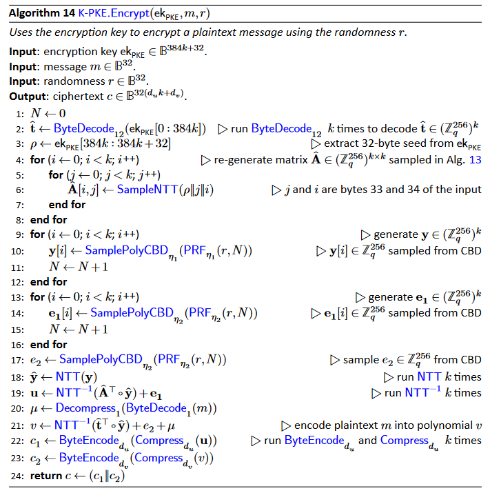
* 功能：k-PKE.Encrypt以加密密钥`$ek_{\rm{PKE}}$`、32字节明文m和随机数r作为输入，产生单个输出：密文c。
* 输入：`$ek_{\rm{PKE}}$`的长度为384k+32字节，m为32字节，r为32字节
* 输出：密文c为`$32(d_uk+d_v)$`字节
* 2-3：k-PKE.Encrypt从加密密钥`$ek_{\rm{PKE}}$`中提取向量`$\hat {\pmb t} $`和`$\rho $`。
* 4-8：然后以K-PKE.Gen中相同的方式扩展种子重新生成矩阵`$\hat{\pmb A} $`。
* 9-12: 重复k次调用`$\rm sampleCBD_{\eta_1}$`生成多项式向量`$\pmb y\in (Z_q^{256})^k$`。其中PRF通过调用`${\rm SHAKE256}(r \parallel N,8 \cdot 64 \cdot \eta_1)$`生成`$ 64\eta_1$`字节长度的种子。然后灌入`$\rm sampleCBD_{\eta_1}$`生成多项式系数。其中SHAKE256为kaccak-f标准函数
* 13-16: 重复k次调用`$\rm sampleCBD_{\eta_2}$`生成多项式向量`$\pmb e_1\in (Z_q^{256})^k$`。其中PRF通过调用`${\rm SHAKE256}(r \parallel N,8 \cdot 64 \cdot \eta_2)$`生成`$ 64\eta_2$`字节长度的种子。然后灌入`$\rm sampleCBD_{\eta_2}$`生成多项式系数。其中SHAKE256为kaccak-f标准函数
* 17: 调用`$\rm sampleCBD_{\eta_2}$`生成多项式`$e_2\in Z_q^{256}$`。
* 18-19:计算噪声方程`$\pmb c_1=\pmb {\rm A}^T \pmb y+\pmb e_1 $`，其中`$\pmb c_1\in (Z_q^{256})^k$`
* 20：调用`$\rm ByteDecode_1$`将明文32字节的明文m解码成元素大小为1 bit 整数数组，长度为256。然后调用解压缩函数`$\rm Decompress_1$` 即将整数数组的每个元素都扩展为12bit。这一步实质是把明文m的每一个bit编码到多项式系数中。
* 21：计算噪声方程`$c_2= {\pmb t}^T \pmb y+\pmb e_2+m $`，其中`$c_2\in Z_q^{256}$`
* 22: 分别调用k次`$\rm ByteEncode_{d_u}$`和`$\rm compress_{d_u}$`,其中`$\pmb u\in (Z_q^{256})^k$`。对于多项式`$\pmb u[i]\in Z_q^{256}$`，即将其每一个系数都进行压缩，将q bit转换为`$d_u$` bit大小。然后对`$temp=\rm compress_{d_u}(\pmb u[i]) \in Z_q^{256}$`执行编码，得到字节数组`$tempB \in Z_{d_u}^{256}$`。整个过程的长度转换为：`$256 \times 12 \times k \;bit \Rightarrow 256 \times d_u \times k  \;bit= 32 \times d_u \times k  \;Byte$`。返回`$32d_uk$`的字节数组`$c_1$`
* 23:同理，返回`$32d_v$`的字节数组`$c_2$`
* 24:最后将`$c_1,c_2$`拼接后输出c

***
### (3)k-PKE.Decrypt解密算法
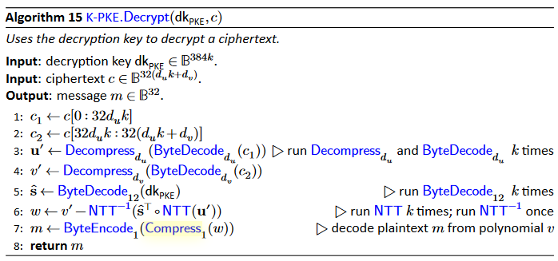
* 功能:k-PKE.Decrypt以解密密钥`$dk_{\rm{PKE}}$`、密文c作为输入，产生单个输出：明文m。
* 输入：解密密钥`$dk_{\rm{PKE}}$`长度为384k字节的字节数组，`$32(d_uk+d_vk)$`字节的密文
* 输出：32字节的明文m
* 1-2:分离`$c_1,c_2$`,注意着`$B[k:m]=(B[k],B[k+1],\dots,B[m-1])$`
* 3:`$c_1$`经过`$\rm ByteDecode_{d_u}$`和`$\rm Decompress_{d_u}$`的长度变换为，`$32 \times d_u \times k  \;Byte=256 \times d_u \times k  \;bit \Rightarrow 256 \times 12 \times k \;bit  $`
* 4:`$c_2$`经过`$\rm ByteDecode_{d_v}$`和`$\rm Decompress_{d_v}$`的长度变换为，`$32 \times d_v \;Byte=256 \times d_v \;bit \Rightarrow 256 \times 12 \;bit  $`
* 5:将`$dk_{\rm{PKE}}$`解码，长度变换为，`$384k\;Byte=256 \times 12 \times k \;bit \Rightarrow 256 \times 12 \;bit  $`
* 6:核心过程，即计算`$m=c_2-\pmb s^T\pmb c_1={\pmb t}^T \pmb y+\pmb e_2+m-\pmb s^T(\pmb {\rm A}^T \pmb y+\pmb e_1)=({\pmb A \pmb s+\pmb e})^T \pmb y+\pmb e_2+m-\pmb s^T(\pmb {\rm A}^T \pmb y+\pmb e_1)=m+\pmb e^T\pmb y+e_2-\pmb s^T\pmb e_1$`，该代码行中`$w\in Z_q^{256} $`
* 7:对多项式w的每个系数执行压缩，长度变换`$256 \times 12 \;bit\Rightarrow 256 \;bit  $`,最后编码成32字节的明文m.

*** 
## 4.内部算法ML_KEM_internal
* 本节指定了三种算法：
  * ML-KEM.KeyGen_internal 
  * ML-KEM.Encaps_internal
  * ML-KEM.Decaps_internal
* 这三种算法都是确定性的，这意味着它们的输出完全由它们的输入决定。在这些算法中没有随机抽样。这三种算法将用于构造ML-KEM。本节中的算法使用了参数`$n,q,k,d_u,d_v $`。
它们调用的子程序还使用了参数`$\eta_1,\eta_2 $`。当n=256，q=3329时，其余参数在可能的参数集之间变化。本节中指定的接口将用于通过加密算法验证程序（CAVP）测试ML-KEM实现。本节中的密钥生成函数也可用于从种子重新扩展密钥，本节中指定的接口**不应提供给除测试目的**以外的应用程序，以及随机种子（如ML-KEM中指定的）。

### (1)ML-KEM.KeyGen_internal 
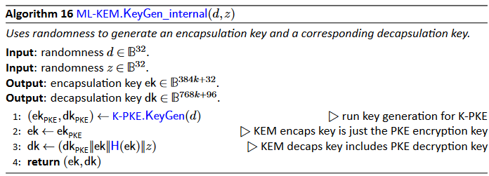
* 输入：随机种子d、z,长度为32的字节数组
* 输出：封装密钥ek为384k+32长度的字节数组，解封装密钥dk为768k+96长度的字节数组
* 1:调用k-PKE.KeyGen(d),生成长度为384k+32字节的加密密钥 `$ek_{\rm{PKE}}$`和长度为384k字节解密密钥`$dk_{\rm{PKE}}\in B^{384k}$` 
* 2：封装密钥ek就是加密密钥
* 3：首先计算封装密钥的哈希值，H(ek)=SHA3-256(ek)，H(ek)输出为32字节，SHA3-256为哈希标准函数。然后将`$dk_{\rm{PKE}}，ek，H(ek),z$` 拼接，所以长度为：`$384k+32+384k+32+32=768k+96$`
### (2)ML-KEM.Encaps_internal
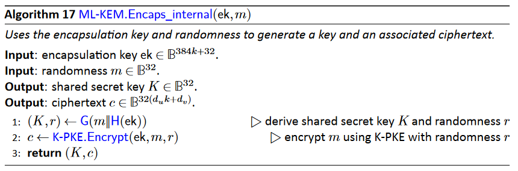
* 输入：封装密钥ek,以及32字节随机数m
* 输出：32字节共享密钥K，`$32(d_uk+d_v)$`字节密文c
* 1：m||H(ek)为33字节，(K,r)=G(m||H(ek))=SHA3-512(m||H(ek)),即将32+1个字节扩展为两个32字节的随机种子,其中SHA3-512为哈希标准函数
* 2:调用k-PKE.Encrypt

### (3)ML-KEM.Decaps_internal
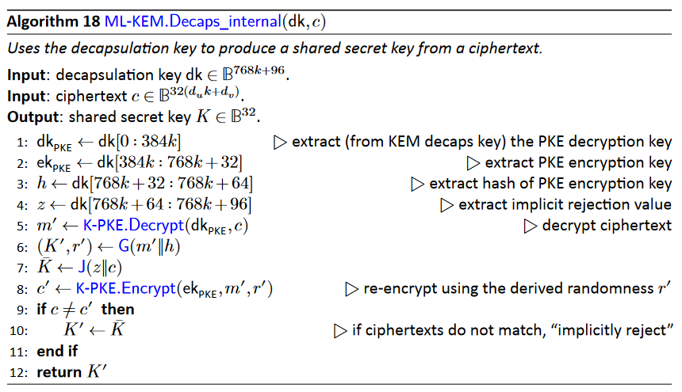
* 输入：768k+96字节的解封装密钥dk,以及`$32(d_uk+d_v)$`字节密文c
* 输出：32字节共享密钥K，
* 1-4：从dk中恢复将`$dk_{\rm{PKE}}，ek，H(ek),z$` 
* 5: 对c进行解密得m'
* 6-7:计算检查失败时用于隐式拒绝的共享密钥`$\overline K$`
* 8:对m'再次加密得得c'
* 9-12:执行检查并返回共享密钥

## 5.ML-KEM密钥封装机制
### (1)ML-KEM参数说明
* ML-KEM包含以下3个子算法：
  * ML-KEM.KeyGen()
  * ML-KEM.Encaps()
  * ML-KEM.Decaps()
* ML-KEM有3组不同的参数取值，`$k,\eta_1,\eta_2，d_u,d_v$`，n=256和q=3329
  * k决定k-PKE中的多项式矩阵`$\hat {\pmb A}$`维数，多项式向量`${\pmb s,\pmb e,\pmb y,\pmb e_1}$`的维数
  * `$\eta_1$`决定多项式向量`${\pmb s,\pmb e,\pmb y}$`的分布
  * `$\eta_2$`决定多项式向量`${\pmb e_1}$`和多项式`${e_2}$`的分布
  * `$d_u,d_v$`决定压缩compress，解压缩Decompress,编码ByteEncode和解码ByteDecode的压缩尺寸
* 标准参数如下表2所示，表3相应给出了每个参数集的ML-KEM密钥和密文的大小
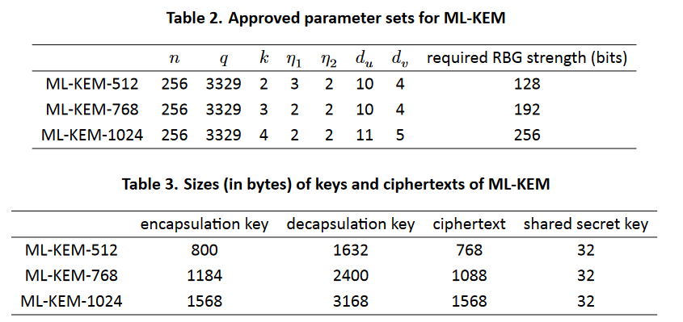

***
### (2)ML-KEM.KeyGen
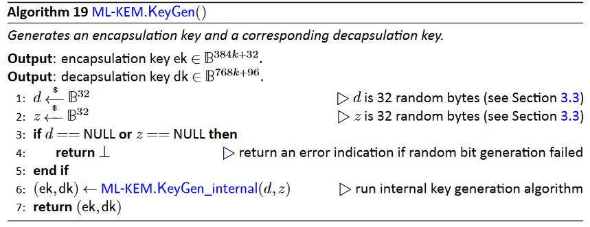
* ML-KEM不接受任何输入；
* 输出：封装密钥ek和解封装密钥dk
* 1-2:生成随机种子d,z
* 3-5:执行随机生成检查
* 6：调用内部ML-KEM.KeyGen_internal 
  
* 如果用户不是自己生成的密钥，而是从第3方收到一对密钥，用户可以进行如下检查，确保密钥对的合法性
  * 种子一致性检查：如果有种子(d,z)，执行ML-KEM.KeyGen_internal，验证输出是否与收到的密钥对一致
  * 封装密钥检查：见ML-KEM.Encaps()
  * 解封装密钥检查：见ML-KEM.Decaps()
  * 密钥对一致性：随机生成一个消息m;利用ML-KEM.Encaps_internal生成（K,c）;利用ML-KEM.Decaps_internal生成K';检查K'和K是否一致。不一致，则拒绝

***
### (3)ML-KEM.Encaps
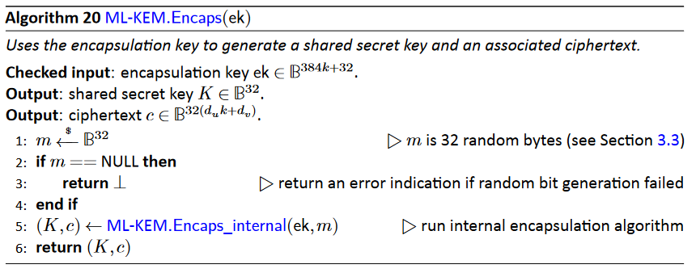
* 在运行上述算法前需要先检查封装密钥ek的合法性
  * 类型检查：如果ek不是一个长度为384k+32的字节数组，则检查失败
  * 模数检查：计算`$test=ByteEncode_{12}(ByteDecode_{12}(ek[0:384k]))$`,如果test==ek[0:384k],则通过，反之则失败
* 输入：384k字节的封装密钥ek
* 输出：共享密钥K和密文c

*** 
### (4)ML-KEM.Decaps
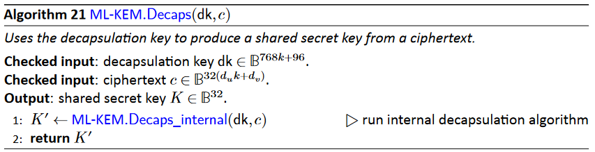
* 在运行上述算法前需要先检查解封装密钥(dk,c)的合法性
  * 密钥类型检查：如果c不是一个长度为`$32(d_uk+d_v)$`的字节数组，则检查失败
  * 解封装密钥类型检查：如果dk不是一个长度为768k+96的字节数组，则检查失败
  * 哈希检查：计算test=H(dk[384k:768k+32]),如果test！=dk[768k+32:768k+64],则检查失败
* 输入：768k+96字节的解封装密钥dk和密文c
* 输出：共享密钥K