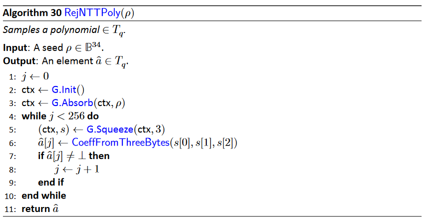
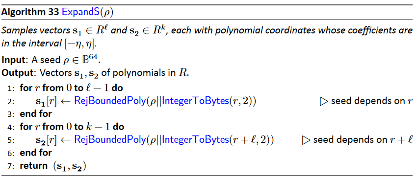
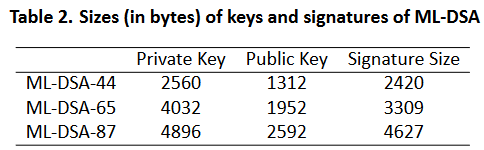

[TOC]
# CRYSTALS-Dilithium 算法梳理
'''
@Descripttion: CRYSTALS-Dilithium 算法梳理
@version: V1.0
@Author: HZW
@Date: 2025-03-10 16:51:00
'''
## 简介
* ref:doc/NIST.FIPS.204.pdf
* 本文档旨在梳理ML_DSA算法的数据流变化;
* 阅读时，简要阅读1.辅助函数章节，重点关注2.ML_DSA内部组件;
* 如果只关注算法流程，可以跳过1.5.快速数论变换（NTT）的原理推导部分;
* 在阅读2.ML_DSA内部组件时，可以不用关注NTT,INTT以及辅助函数的具体实现;
* 重点关注数据位宽的变化;

## 1.辅助函数
***
### 1.1 数据类型转换
#### (1)IntegerToBits(x,a)

* 功能：计算整数$y=x \bmod 2^{\alpha}$,并转为bit数组
* y这里为小端存储，比如 $11010001=2^0+2^1+2^3+2^7=139$  
* 硬件实现时直接截取低$\alpha$位

***
#### (2)BitsToInteger(y,a)

* 功能：将长度为$\alpha$bit的比特数组y转换为整数x
* y这里为小端存储，比如 $11010001=2^0+2^1+2^3+2^7=139$  
***

#### (3)IntegerToBytes(x,a)

* 功能：计算整数$y=x \bmod 256^{\alpha}$,并转为字节数组
* y这里为小端存储，以字节为单位的小端序

#### (4)BitsToBytes(y)

* 功能：比特数组转字节数组
* b这里为小端存储，比如 $11010001=2^0+2^1+2^3+2^7=139$  
* 同kyber

***
#### (5)BytesToBits(Z)

* 功能:字节数组转比特数组
* b这里为小端存储，比如 $11010001=2^0+2^1+2^3+2^7=139$  
* 
***
#### (6)CoeffFromThreeBytes(b0,b1,b2)

* 功能:将3个字节转换模q的整数，用于生成多项式系数（拒绝采样）
  
***
#### (7)CoeffFromHalfBytes(b)

* 功能:将元素b转换到$[-\eta,\eta]$,用于生成多项式系数(拒绝采样)

***
#### (8)SimpleBitPack(w)

* 功能:将多项式系数数组w编码为字节数组
* 输入：w为多项式系数数组
* 输出：为字节数组
* 设d=bitlen(b),其中d为w中元素w[i]的位宽，长度变换过程为：$256\cdot d=32\cdot d \cdot 8$
* 同kyber中的编码函数,ByteEncode

#### (9)BitPack(w)

* 功能:将多项式系数数组w编码为字节数组，设d=bitlen(a+b),其中d为w中元素w[i]的位宽，长度变换过程为：$256\cdot d=32\cdot d \cdot 8$

***
#### (10)SimpleBitUnPack(v,b)

* 功能:SimpleBitPack的逆过程
* 同kyber中的解码函数,ByteDecode

#### (11)BitUnPack(v,b)

* 功能:BitPack的逆过程

***
#### (12)HintBitpack(h)

* 功能:将一个具有二进制系数的多项式向量编码为字节数组
* 输入：长度为k的多项式向量系数数组$(h[0],\dots，h[k-1])$,其中h[i]为长度为256的多项式系数数组。其中多项式向量系数数组至多有w个非零系数。
* 输出：长度为w+k的字节数组y,前w的元素记录非零位置，后k个字节用于记录每个h[i]中多少个非零bit

#### (13)HintBitUnPack(y)

* 功能:HintBitpack的逆过程
* 输入：长度为k的多项式向量系数数组$(h[0],\dots，h[k-1])$,其中h[i]为长度为256的多项式系数数组。其中多项式向量系数数组至多有w个非零系数。
* 输出：长度为w+k的字节数组y,前w的元素记录非零位置，后k个字节用于记录每个h[i]中多少个非零bit

***
### 1.2 ML_DSA密钥和签名的编码
#### (14)pkEncode

* 功能:实际就是编码函数的扩展

#### (15)pkDecode

* 功能:实际就是解码的扩展

***
#### (16)skEncode

* 功能:实际就是编码函数的扩展

#### (17)skDecode

* 功能:实际就是解码的扩展

***
#### (18)sigEncode

* 功能:实际就是编码的扩展

#### (19)sigDecode

* 功能:实际就是解码函数的扩展
***
#### (20)w1Encode

* 功能:实际就是编码的扩展

***
### 1.3 伪随机采样
#### (21)SampleInBall

* 功能：通过H函数从一个长度为$\lambda/4$的字节数组种子中扩展，然后通过拒绝采样生成一个长度为256的多项式，其中多项式的系数属于{-1,0,1}

#### (22)RejNTTPoly

* 功能:通过G函数从一个长度为34的字节数组种子中扩展，生成多项式的NTT形式系数表示

#### (23)RejBoundedPoly

* 功能:通过H函数从一个长度为64的字节数组种子中扩展。然后通过拒绝采样生成多项式

#### (24)ExpandA

* 功能:重复调用RejNTTPoly生成多项式矩阵$\hat {\pmb A}$

#### (25)ExpandS

* 功能:重复调用RejBoundedPoly生成多项式向量$\pmb s_1,\pmb s_2$

#### (26)ExpandMask

* 功能:
  
***
### 1.4 高阶位和低阶位提示
* **Power2Round,Decompose,HighBits,LowBits,Makehint,UseHint**全部都是用于多项式的每个系数

* Power2Round:分解$r\bmod q=r_1\cdot 2^d+r_0$的高低位比特，其中$r \in \Z_q$。
$$
\begin{equation}
    \begin{split}
    r_0&=(r\bmod q)\bmod ^{\pm}2^d \\
    r_1&=(r\bmod q-r_0)/2^d
    \end{split}
\end{equation}
$$

#### (27)Power2Round

* 功能:将整数环上的数分解为两部分
  

#### (28)Decompose

* 功能:将整数环上的数分解为两部分,用于与提示相关的计算

#### (29)HighBits

* 功能:从Decompose中返回高位

#### (30)LowBits

* 功能:从Decompose中返回低位

#### (31)MakeHint

* 功能:用于判断向$r$中添加$z$是否改变$r$的高位

#### (32)UseHint

* 功能:返回根据提示调整的后的$r$的高位

***
### 1.5 快速数论变换
#### （1）NTT的原理
* 由于Dilithium中采用$q=838047,n=256$,因此存在512次本源根，能够将多项式环$\Z_q[X]/(X^{256}+1)$完全分解为256个一次多项式环，其中$\zeta =1753$是512次单位根

$$
\begin{equation}
    \begin{split}
      {\zeta ^{512}} = ({\zeta ^{256}})^2 \equiv 1 \bmod q  \Rightarrow  {\zeta ^{256}} \equiv -1 \bmod q 
    \end{split}
\end{equation}
$$

则：
$$
\begin{equation}
    \begin{split}
    X^{256}+1&=(X^{256}-{\zeta ^{256}}) \\
    &=\prod\limits_{i = 0}^{255} {(X-{\zeta ^{i}})}\\
    &=\prod\limits_{i = 0}^{255} {(X-{\zeta ^{ \mathrm {BitRev_8}{(i)}}})}\bmod q
    \end{split}
\end{equation}
$$

其中$\mathrm {BitRev_8}(r)$作用是将8bit无符号数的bit位顺序反转，即$\mathrm {BitRev_8}(r)=\mathrm {BitRev_8}(r_02^0+r_12^1+\dots r_72^7)=r_72^0+r_52^1+\dots r_02^7$。因此，多项式环${R_q} = {\Z_q}[X]/({X^{256}} + 1)$同构于256个一次扩展的直和，即${T_q} =\bigoplus\limits_{i=1}^n {\Z_q[X]/(X-{\zeta ^{\rm {BitRev_8}{(i)}}})}$.

多项式$f = \sum\limits_{i = 0}^{255} {{f_i}} {x^i}$的NTT形式为：
$$
\begin{equation}
    \begin{split}
    \hat f = \mathrm{NTT}(f) = {\hat f_0} + {\hat f_1}X +  \cdots {\hat f_{255}}{X^{255}}
    \end{split}
\end{equation}
$$

注意上述代数结构$\mathrm {NTT}(f)$不具有任何数学意义。基于环上中国剩余定理，即多项式环$R_q \to T_q$的同构映射。实际$\mathrm {NTT}(f)$的各个系数可以表示为以下256个0次剩余多项式组成的向量:
$$
\begin{equation}
    \begin{split}
      \hat f &= \mathrm {NTT}(f) \\
      &= (f\bmod X-{\zeta ^{\mathrm{BitRev_8}(0)}},\dots,f\bmod X-{\zeta ^{ \mathrm {BitRev_8}(255)}})\\
      &=({\hat f_0},{\hat f_1},\dots,{\hat f_{254}},{\hat f_{255}}) \\
    \end{split}
\end{equation}
$$

证明以下过程：$ f\bmod X-{\zeta ^{ \mathrm{BitRev_8}(i)}} \Rightarrow {\hat f_{i}} $
因为：$X \equiv {\zeta ^{\mathrm{BitRev_8}(i)}} \bmod X-{\zeta ^{\mathrm{BitRev_8}(i)}}$
$$
\begin{equation}
    \begin{split}
      f\bmod X-{\zeta ^{\mathrm{BitRev_8}(i)}} &=\sum\limits_{j = 0}^{255} {{f_j}} {x^j}\bmod X-{\zeta ^{ \mathrm{BitRev_8}(i)}} \\
      &=(\sum\limits_{j = 0}^{255} {{f_{j}}} {x^{j}})\bmod X-{\zeta ^{ 
      \mathrm{BitRev_8}(i)}} \\
      &=(\sum\limits_{j = 0}^{255} {{f_{j}}} {{\zeta ^{ 
      \mathrm{BitRev_8}(i)j}}})\bmod X-{\zeta ^{\mathrm{BitRev_8}(i)}}
    \end{split}
\end{equation}
$$
令：
$$
\begin{equation}
    \begin{split}
      &\hat f_{i}
      =\sum\limits_{j = 0}^{255} {{f_{j}}} {{\zeta ^{(
      \mathrm{BitRev_8}(i))j}}}
    \end{split}
\end{equation}
$$
因此，$ f\bmod X-{\zeta ^{\mathrm{BitRev_8}(i)}} = {\hat f_{i}}$
**实际上NTT算法的核心就是利用单位根的对称性加速式（7）的计算**
***
#### （2）PWM逐点乘法，符号记作$\circ$
对于多项式乘法$h(x)=f(x)\cdot g(x)\bmod x^n+1$，其中$h(x)$的NTT向量形式为$(\hat f_{0},\hat f_{1},\dots,\hat f_{255})$，$g(x)$的NTT向量形式为$(\hat g_{0},\hat g_{1},\dots,\hat g_{255})$
则多项式乘积的NTT系数向量为：

$$
\begin{equation}
    \begin{split}
        (\hat h_{0},\hat h_{1},\dots,\hat h_{255}) &= (\hat f_{0},\hat f_{1},\dots,\hat f_{255})\circ (\hat g_{0},\hat g_{1},\dots,\hat g_{255})\\
        &=(F_0\cdot G_0\bmod X-{\zeta ^{ \mathrm{BitRev_8}(0)}},\dots,F_{255}\cdot G_{255}\bmod X-{\zeta ^{ \mathrm{BitRev_8}(255)}})
    \end{split}
\end{equation}
$$
***
#### （3）伪代码
##### (33)NTT

* 功能:核心过程采用的cooley-Tukey(CT)蝶形运算，又称为时域抽取（DIT）。对于应12-14行。
##### (34)INTT

* 功能: 核心过程采用的Gentleman-Sande(GS)蝶形运算，又称为频域抽取（DIF）对于应13-15行。
##### (35)BitRev8

***
##### (36)AddNTT

* 功能：实现多项式系数NTT表示的逐点加法

##### (37)MultiplyNTT（PWM）

* 功能：实现多项式系数NTT表示的逐点乘法

##### (38)AddVectorNTT

* 功能：实现多项式向量的系数NTT表示的逐点加法
##### (39)ScalarVectorNTT

* 功能：依次对多项式向量中的每个多项式的NTT表示进行标量的逐点乘法

##### (40)MatrixVectorNTT

* 功能：NTT形式的多项式矩阵乘法

* **上述过程除了PWM以外，和kyber的NTT完全一致**
  
## 2.ML_DSA内部组件方案（internal）

* **除了测试目的外，本部分规定的密钥生成和签名生成的接口不应提供给应用程序，因为密钥生成和签名生成所需的任何随机值都应由密码模块生成**

### 2.1 参数说明

* q:模数
* $\zeta$:512次单位根
* d:公钥多项式$\pmb t$每个系数需要丢弃的bit数
* $\tau$:验证者挑战的多项式c的汉明权重
* $\lambda$:碰撞强度
* $\gamma_1$:多项式向量$\pmb y$的系数范围
* $\gamma_2$:低位舍入范围
* $\eta$:私钥的系数范围
* $w$:提示向量$\pmb h$中1的最大个数

### 2.2 ML_DSA内部组件方案
#### (1)ML_DSA Key Generation密钥生成算法

* 输入：通过SHAKE256生成的种子$\xi$,长度为32的字节数组
* 输出：公钥pk,长度为$32+32k(\mathrm {bitlen}(q-1)-d)$的字节数组；私钥sk,长度为$32+32+64+32((l+k)\mathrm {bitlen}(2\eta)+dk)$的字节数组
* 1：将种子$\xi$与$k,l$的1字节形式拼接，然后送入H函数（实际上为SHAKE256）,扩展出长度为32字节的公共随机种子$\rho$，以及64字节和32字节的私钥随机种子$\rho'$和K
* 3:通过32字节的公共随机种子$\rho$以及ExpandA获取公钥矩阵$\hat {\pmb A}$，该过程类似于kyber,但采样细节有所区别
* 4：通过64字节的公共随机种子$\rho$以及ExpandS获取多项式向量$\pmb s_1,\pmb s_2$，其中多项式的系数在$(-\eta,\eta)$范围内
* 5：计算公钥多项式向量$\pmb t$
* 6：采用Power2Round公钥多项式向量$\pmb t$中每个多项形式系数高低为比特分离，从而实现压缩，降低计算量
* 8：将公钥多项式向量$\pmb t1$和$\rho$进行编码，过程和kyber完全一致
* 9：计算公钥pk的哈希，输出长度为64的字节数组tr
* 10:对私钥随机种子$\rho,K,tr,\pmb s_1,\pmb s_2,\pmb t_0$进行编码

#### (2)ML_DSA Signing签名算法

* 功能：以编码为字节数组的私钥sk,编码为bit数组的格式化消息M'以及32字节的随机数rnd作为输入，输出编码为字节数组的签名。
* ML_DSA Signing有对冲和确定性变体两种。对冲使用的是新的随机值，而确定性变体使用的是常量字节数组（{0}32）
* 输入：
  * 私钥sk,长度为$32+32+64+32((l+k)\mathrm {bitlen}(2\eta)+dk)$的字节数组
  * 格式化消息M':比特数组
  * 随机变量rnd:32长度的字节数组
* 输出：签名$\sigma$,长度为$\lambda/4+32l(1+bitlen(\gamma_1-1))+w+k$,其中$\lambda/4$为碰撞强度，$\gamma_1$为多项式向量$\pmb y$的系数范围，$k,l$为多项式矩阵的维度，$w$为提示$\pmb h$的中1bit的个数
* 1：签名者通过skDecode从私钥sk中提取以下信息：公共随机种子$\rho$，32字节的私有随机种子K，64字节的公有密钥pk的哈希值，私钥多项式向量$\pmb s_1$和$\pmb s_2$，以及编码未压缩的公有密钥多项式$\pmb t$的每个系数的d个最低有效位的多项式向量$\pmb t_0$。
* 2-4:分别对私钥多项式向量$\pmb s_1$和$\pmb s_2$以及多项式向量$\pmb t_0$执行NTT
* 5:通过ρ恢复与密钥生成相同的矩阵$\hat {\pmb A}$
* 6：在消息M'进行签名之前，将其与公钥哈希tr进行级联，并使用H将其哈希到一个64字节的消息代表$\mu$
* 7:在每次签名过程中，签名者需要产生一个额外的64字节的种子$\rho''$，用于产生私钥的随机性。$\rho''$的计算为$\rho''=\mathrm H(K||rnd||\mu,64)$。在默认的对称变体中，rnd是一个RBG的输出，而在确定的变体中，rnd是一个32字节的字符串，它完全由零组成。这是ML-DSA的确定性变体和对冲变体的唯一区别。
* 10-32：签名算法的主要部分，由一个拒绝采样循环组成，在该循环的每次迭代中，要么产生一个有效的签名，要么产生一个无效的签名，这些签名的释放会泄露私钥的信息。循环重复进行，直到产生有效的签名，然后可以将其编码为字节数组并输出。
* 11：使用`ExpandMask`函数、随机种子$\rho''$以及计数器,从系数为$[-\gamma_1+1,\gamma_1]$的多项式向量集合中采样一个长度为$l$的多项式向量$\pmb y$
* 12-13：计算$\pmb w=\pmb A \pmb y$，通过`Highbits`计算承诺$\pmb w_1$，即提取多项式向量$\pmb w$中每个系数的高位bit（相当于压缩函数），$\pmb w_1$的包含k个多项式
* 15：将承诺$\pmb w_1$的编码和消息代表$\mu$级联，并通过H函数哈希到长度$\lambda/4$的承诺哈希$\tilde c$（字节数组）
* 16：将承诺哈希$\tilde c$（字节数组）用于伪随机采样一个系数为{-1,0,1}以及汉明权重为$\tau$的多项式c（验证者挑战）,是一个长度为256的整数数组
* 17-20：通过计算$\pmb z=\pmb y+c\pmb s_1$获取响应多项式向量$\pmb z$
* 21:提取$\pmb w-c\pmb s_2$的低比特
* 23-32：执行有效性检查，通过则生成提示$\pmb h$并退出循环，不通过则继续
* 33：将承诺哈希$\tilde c$、响应$\pmb z \bmod^{\pm}q$和提示$\pmb h$的字节编码获得签名

#### (3)ML_DSA Verifing验证算法

* 功能：将编码为字节数组的公钥pk、编码为比特数组的消息M'和编码为字节数组的签名$\sigma$作为输入。它产生一个布尔值作为输出，如果签名对消息和公钥有效,则该值为真;如果签名无效,则该值为假。
* 输入：
  * 公钥pk,长度为$32+32k(\mathrm {bitlen}(q-1)-d)$的字节数组
  * 格式化消息M':比特数组
  * 签名$\sigma$,长度为$\lambda/4+32l(1+bitlen(\gamma_1-1))+w+k$,其中$\lambda/4$为碰撞强度，$\gamma_1$为多项式向量$\pmb y$的系数范围，$k,l$为多项式矩阵的维度，$w$为提示$\pmb h$的中1bit的个数
* 输出：布尔值
* 1-2：验证者首先从公钥pk中提取出公共的随机种子ρ和压缩多项式向量$\pmb t_1$，从签名中解码出承诺哈希$\tilde c$、响应$\pmb z$和提示$\pmb h$
* 3-4：检验提示信息有没有被正确的字节编码，用符号'⊥'表示，在这种情况下验证算法会立即返回错误以表明签名无效。
* 5：通过公共随机种子ρ恢复出矩阵$\hat {\pmb A}$
* 6：将公钥pk哈希到64字节的tr上
* 7：将消息M'与公钥哈希tr进行级联，并使用H将其哈希到一个64字节的消息代表$\mu$上
* 8：将承诺哈希$\tilde c$（字节数组）用于伪随机采样一个系数为{-1,0,1}以及汉明权重为$\tau$的多项式c（有称为验证者挑战）,是一个长度为256的整数数组
* 9-10：验证者从公钥pk和签名$\sigma$重建签名者的承诺，即多项式向量$\pmb w_1$。核心过程如下：
$$
\begin{equation}
    \begin{split}
    \pmb w&=\pmb A\pmb y\\
    &=\pmb A(\pmb z-{c}\pmb s_1)\\
    &=\pmb {Az}-c\pmb {As_1}\\
    \because \pmb {t=As_1+s_2} \\
    &=\pmb {Az}-c(\pmb {t-s_2})\\
    &=\pmb {Az}-c\pmb t+c\pmb s_2
    \end{split}
\end{equation}
$$
由于$c,\pmb s_2$的系数很小，因此$\pmb t_1 \cdot 2^d\approx \pmb t$。验证者计算$\pmb w'_{Approx}$：
$$
\begin{equation}
    \begin{split}
    \pmb w'_{Approx} =\pmb {Az}-c\pmb t_1\cdot 2^d
    \end{split}
\end{equation}
$$
然后利用签名者的提示$\pmb h$从$\pmb w'_{Approx}$中恢复$\pmb w'_1$。
* 12：将计算的消息代表$\mu$和重建的承诺$\pmb w'_1$级联，然后哈希得到承诺哈希$\tilde c'$
* 13：最后验证响应$\pmb z$的所有系数是否都在$(-(\gamma_1-\beta),\gamma_1-\beta)$范围内，并且重建的承诺哈希$\tilde c'$与签名者的承诺哈希$\tilde c$是否一致。若都一致，则返回true，表示签名有效,否则返回false，签名无效。

## 3.ML_DSA外部组件方案（external）
### (1)ML-DSA_KeyGen

* 功能：使用RBG来产生一个32字节的随机种子$\xi $，并将其作为ML_DSA_KeyGen_internal的输入 ，产生公钥和私钥

### (2)ML-DSA_Sign

* 功能：将私钥和消息以及小于255字节的文本作为输入，输出编码为字节数组的签名
* 1-3：验证文本是否小于255字节，是则执行下一步
* 5：产生一个32字节的随机数组rnd
* 6-9：验证rnd是否成功生成
* 10：将消息M和ctx级联后转换为bit数组
* 11：调用内部签名函数生成签名

### (3)ML-DSA_Verify

* 功能：以公钥pk、消息M、签名$\sigma$和文本字符串作为ctx输入。公钥、签名和文本字符串均编码为字节数组，而消息为比特字符串。ML-DSA_Verify输出一个布尔值，如果该签名相对于消息和公钥有效，则为真；如果该签名无效，则为假。
  
  