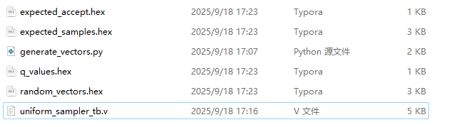
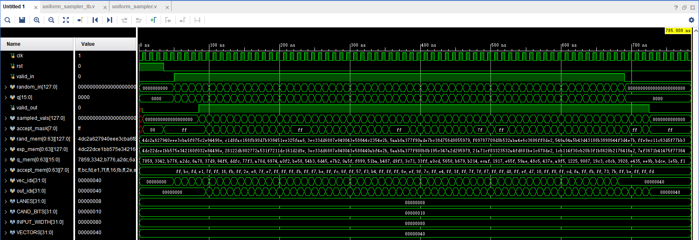
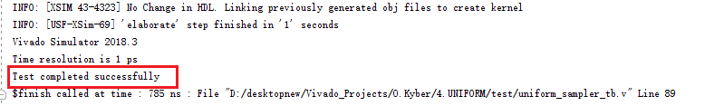
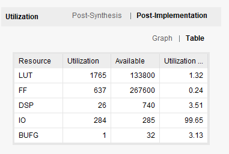
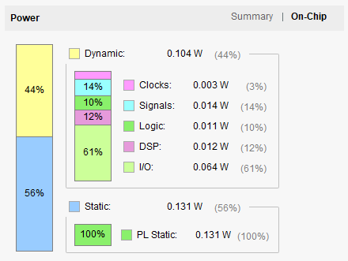
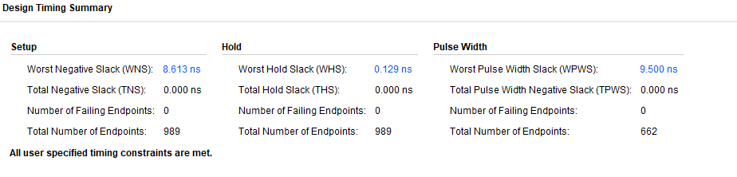

# 均匀采样模块说明

Time: 2025/9/15/17点20分

Author: HaoWang

## 模块概述
`uniform_sampler` 模块实现针对参数 `q` 的多通道均匀采样，通过 Barrett 除法进行模运算加速，并在流水线结构中实现多路并行处理。模块支持来自 SHAKE 或其他 PRNG 的 128 位随机输入流，在 8 条通道上并行生成样本，每条通道输出一个 `[0, q)` 范围内的随机数。模块还输出每条通道的接受标志，方便在系统级实现拒绝采样。

## 接口说明
| 端口 | 方向 | 宽度 | 说明 |
| --- | --- | --- | --- |
| `clk` | 输入 | 1 | 模块时钟输入 |
| `rst` | 输入 | 1 | 异步复位，低电平释放 |
| `valid_in` | 输入 | 1 | 输入有效标志 |
| `random_in` | 输入 | 128 | PRNG 的随机输入数据，8 个 16 bit 候选值 |
| `q` | 输入 | 16 | 模运算参数，目标范围 `[0, q)` |
| `valid_out` | 输出 | 1 | 输出有效标志，延迟 3 个周期 |
| `sampled_vals` | 输出 | 128 | 并行输出的均匀采样结果 |
| `accept_mask` | 输出 | 8 | 每条通道的接受标志，`1` 表示候选值通过拒绝采样 |

## 设计细节
- **Barrett 除法**：模块在第 2、3 级流水线中使用 Barrett 系数对候选值进行模运算，避免了高延时的除法器，实现快速求余。
- **流水线结构**：整体分为三个阶段：
  1. 输入缓存与 Barrett 系数/接受阈值预计算；
  2. 候选值与 Barrett 系数乘法计算；
  3. Barrett 减法与最终接受判定。
  每级流水线均使用寄存器锁存数据，保证在高频率下的时序稳定性。
- **并行处理**：`LANES` 参数控制并行通道数，本设计默认 8 条通道，每条通道独立完成 Barrett 计算。
- **拒绝采样支持**：通过接受阈值 `limit` 判断候选值是否可直接接受，若超出阈值，`accept_mask` 中对应位为 0，系统可请求新的随机数。

## 仿真与验证

运行goldenmodel，生成四组测试文件。

观察Vivado的Tcl，显示测试通过

- `4.UNIFORM/test/generate_vectors.py`：Python 黄金模型，用于生成随机输入、参数 `q` 以及对应的期望输出。脚本会输出 64 组测试向量。
- `4.UNIFORM/test/uniform_sampler_tb.v`：基于 Icarus Verilog 的 testbench，从黄金模型生成的文件中读取测试向量，对比模块输出与期望值并检查 `accept_mask`。
- 运行流程：
  1. 执行 `python3 4.UNIFORM/test/generate_vectors.py` 生成测试向量；
  2. 使用 `iverilog -g2012` 编译仿真；
  3. 使用 `vvp` 运行仿真，输出 `Test completed successfully` 即表示通过。

## Synthesis与Implementation

Fmax=87.82Mhz

