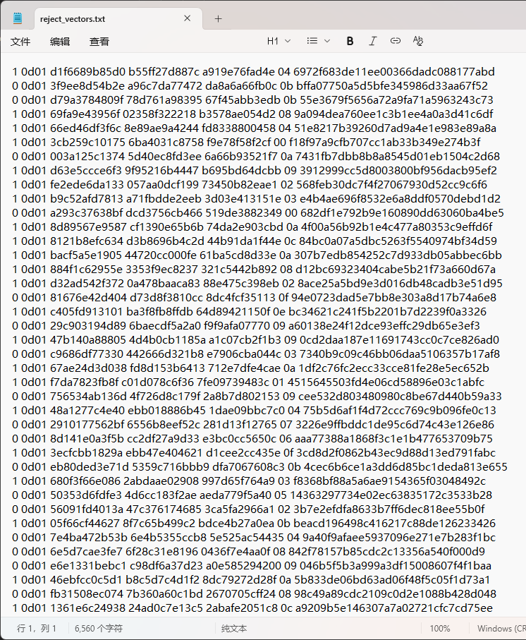
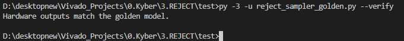
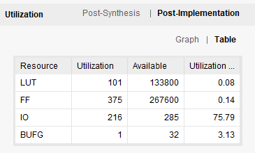
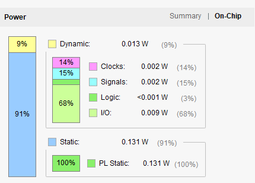
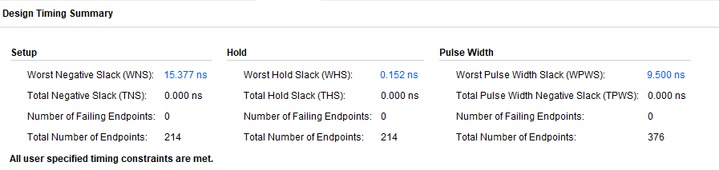

# 拒绝采样硬件模块说明

Time: 2025/9/13/16:30

Author: HaoWang

## 模块概述

`reject_sampler_core` 模块实现了一个可参数化的拒绝采样器，支持同时处理多个 lane 的候选值，并通过两级流水线实现高吞吐量。该模块既支持 `uniform mod q` 模式，也支持基于 LUT 的 Bernoulli 比较，在每个 clock 周期内都能够完成接受判决。

### 主要特性

- **多 lane 并行**：通过参数 `LANES` 与 `CAND_BITS` 控制候选值的数量与位宽。
- **两级流水线**：输入在 Stage0 捕获，Stage1 完成比较，Stage2 输出结果，实现 150 MHz 以上的目标频率。
- **双模式支持**：`mode_select` 位为 0 表示进行 `cand < q` 比较；为 1 时使用 `urnd < threshold` 比较。
- **常时序输出**：`CONST_TIME` 置位时，无论是否存在有效样本均维持固定延迟的输出 `sample_tvalid`。

## 接口说明

| 信号 | 方向 | 位宽 | 描述 |
| --- | --- | --- | --- |
| `clk` | 输入 | 1 | 时钟信号 |
| `rst_n` | 输入 | 1 | 低有效异步复位 |
| `random_valid` | 输入 | 1 | 随机数据有效信号 |
| `random_in` | 输入 | 128 | 外部随机字节流，可用于追踪调试 |
| `q` | 输入 | 16 | `uniform mod q` 模式的阈值 |
| `cand_bus` | 输入 | `LANES*CAND_BITS` | 候选值并行输入 |
| `urnd_bus` | 输入 | `LANES*CAND_BITS` | 均匀随机数输入，用于 Bernoulli 判断 |
| `threshold_bus` | 输入 | `LANES*CAND_BITS` | 各 lane 的比较阈值 |
| `mode_select` | 输入 | `LANES` | 每个 lane 的模式选择位 |
| `acc_bus` | 输出 | `LANES` | 接受标志，表示对应 lane 是否接受样本 |
| `sample_tdata` | 输出 | `LANES*CAND_BITS` | 通过拒绝采样后的噪声样本，未被接受的 lane 填零 |
| `sample_tvalid` | 输出 | 1 | 样本有效指示，`CONST_TIME=1` 时等于 `random_valid` 的延迟版本 |

## 设计结构

1. **Stage0**：在 `random_valid` 为 1 时采样输入候选值、随机数与阈值，并缓存 `q` 与原始随机流。
2. **Stage1**：将 Stage0 的数据进一步寄存，为比较逻辑提供稳定输入。
3. **比较网络**：并行计算每个 lane 的 `uniform` 与 `bernoulli` 接受信号，并根据 `mode_select` 选择。
4. **输出寄存器**：输出 `acc_bus` 与 `sample_tdata`，并根据 `CONST_TIME` 控制 `sample_tvalid`。

## 测试与验证

生成测试向量如下.

运行硬件仿真。

数据比对通过

- `3.REJECT/test/reject_sampler_tb.v`：使用 Icarus Verilog 的 testbench，通过读入 Python 生成的测试向量，对模块进行功能验证。
- `3.REJECT/test/reject_sampler_golden.py`：提供测试向量的生成与硬件输出比对。执行流程如下：
  1. `python 3.REJECT/test/reject_sampler_golden.py` 生成测试向量文件。
  2. `iverilog -g2012 -o reject_tb 3.REJECT/reject_sampler_core.v 3.REJECT/test/reject_sampler_tb.v` 编译仿真。
  3. `vvp reject_tb` 运行仿真，输出结果写入 `hw_output.txt`。
  4. `python 3.REJECT/test/reject_sampler_golden.py --verify` 比对硬件输出与黄金模型，若通过将打印确认信息。

通过上述流程，可确认拒绝采样器在两种模式下均能产生正确的噪声样本，并验证流水线逻辑与常时序设计的正确性。

## Synthesis与Implementation

Fmax=216.31Mhz

