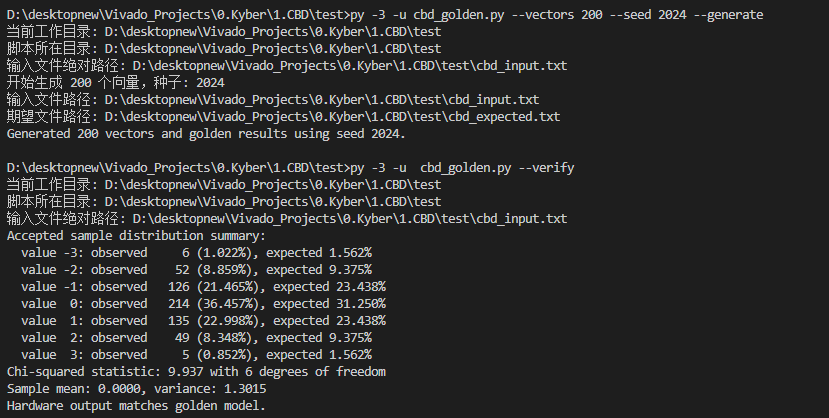
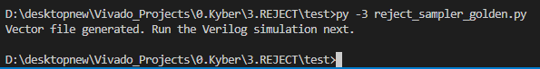
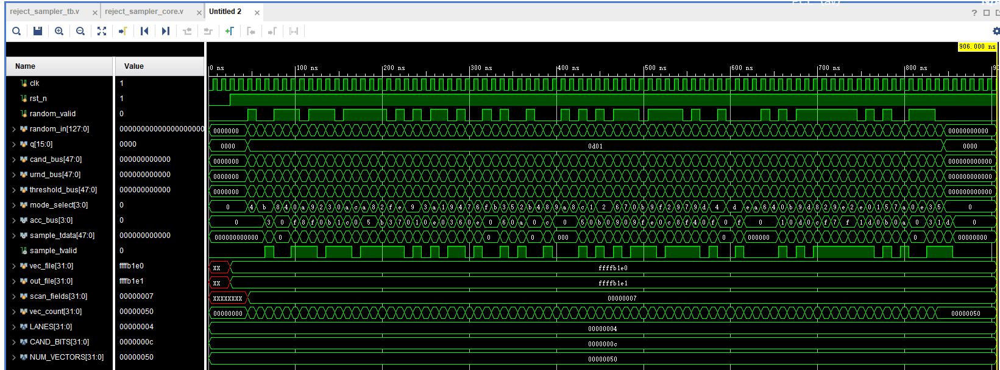
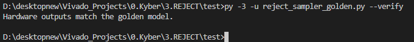
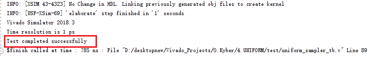
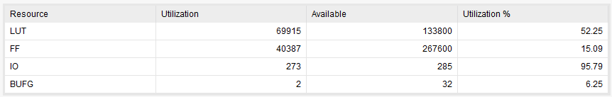
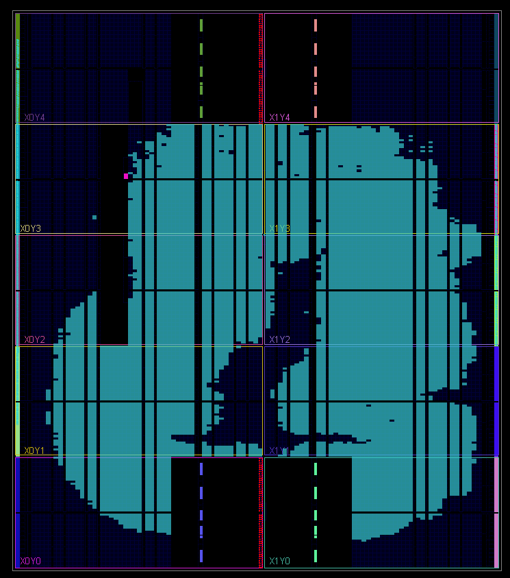
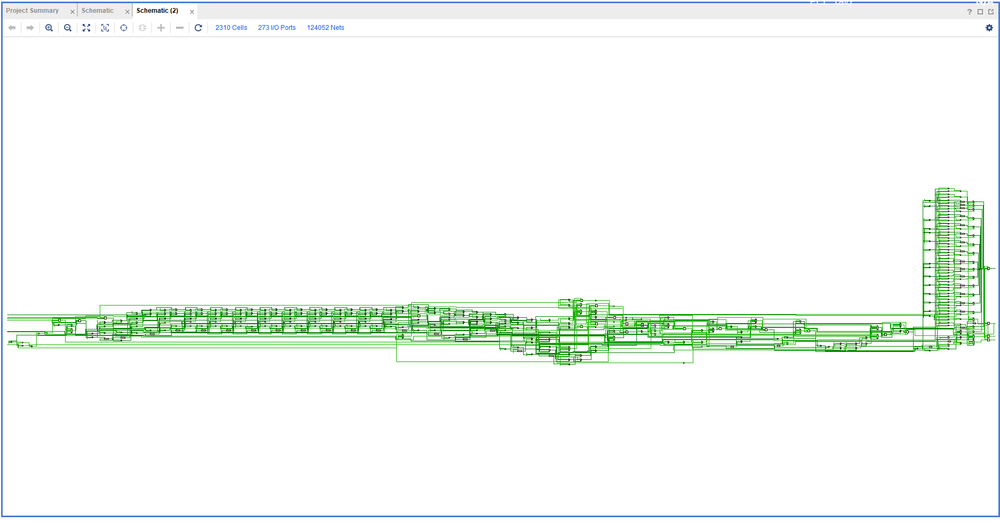

# 做了什么
Time      2025/9/18/19：45
Author  王昊

本周工作聚焦于PQC系列算法**乱数流**生成模块及**采样方法**的硬件实现。
## 1. 采样方法硬件实现
完成了包括**中心二项分布CBD，拒绝采样以及均匀采样模块**的硬件电路电路实现。
### 1.1. CBD（Centered Binomial Distribution）采样模块
设计思想就是流水线核多通道并行采样。

#### 主要文件：

- `cbd_sampler.v`：顶层 CBD 采样器，负责并行管理多个采样通道、与外部控制逻辑交互。
- `cbd_lane.v`：单通道采样核心，实现 CBD 候选值生成、Bernoulli 判决以及拒绝采样。
- `bernoulli_sampler.v`：纯组合的 Bernoulli 判决单元，通过阈值比较生成随机符号。
- `rejection_filter.v`：拒绝采样单元，根据候选值幅度动态调整接受概率。
- `test/cbd_sampler_tb.v`：针对顶层模块的 testbench，驱动随机向量并记录硬件输出。
- `test/cbd_golden.py`：Python 黄金模型，用于生成激励向量、计算期望结果并验证硬件输出，同时给出基础统计检验数据。
#### 顶层 `cbd_sampler`

| 端口 | 方向 | 宽度 | 描述 |
| ---- | ---- | ---- | ---- |
| `clk` | 输入 | 1 | 时钟信号 |
| `reset` | 输入 | 1 | 同步复位，高电平有效 |
| `start` | 输入 | 1 | 触发一次采样操作，在 `valid_in` 有效时加载随机向量 |
| `valid_in` | 输入 | 1 | 随机数据有效指示 |
| `random_in` | 输入 | `RAND_WIDTH` | 来自 SHAKE/PRNG 的随机字节流 |
| `threshold` | 输入 | `BERN_WIDTH` | Bernoulli 采样阈值 |
| `sampled_vals` | 输出 | `LANES*CAND_BITS` | 合并后的 CBD 采样结果，按通道低位打包 |
| `accepted_flags` | 输出 | `LANES` | 各通道拒绝采样接受标志 |
| `done` | 输出 | 1 | 所有通道输出有效时置位 |
采用200个测试向量进行输出特性检测效果如下。

### 1.2. 拒绝采样（Rejection Sampling）模块
支持同时处理多个 lane 的候选值，流水线深度是2级
#### 接口说明

| 信号 | 方向 | 位宽 | 描述 |
| --- | --- | --- | --- |
| `clk` | 输入 | 1 | 时钟信号 |
| `rst_n` | 输入 | 1 | 低有效异步复位 |
| `random_valid` | 输入 | 1 | 随机数据有效信号 |
| `random_in` | 输入 | 128 | 外部随机字节流，可用于追踪调试 |
| `q` | 输入 | 16 | `uniform mod q` 模式的阈值 |
| `cand_bus` | 输入 | `LANES*CAND_BITS` | 候选值并行输入 |
| `urnd_bus` | 输入 | `LANES*CAND_BITS` | 均匀随机数输入，用于 Bernoulli 判断 |
| `threshold_bus` | 输入 | `LANES*CAND_BITS` | 各 lane 的比较阈值 |
| `mode_select` | 输入 | `LANES` | 每个 lane 的模式选择位 |
| `acc_bus` | 输出 | `LANES` | 接受标志，表示对应 lane 是否接受样本 |
| `sample_tdata` | 输出 | `LANES*CAND_BITS` | 通过拒绝采样后的噪声样本，未被接受的 lane 填零 |
| `sample_tvalid` | 输出 | 1 | 样本有效指示，`CONST_TIME=1` 时等于 `random_valid` 的延迟版本 |

这个模块的测试先是基于python的goldenmodel生成测试向量。

测试向量如下所示

然后基于tb中的readmem函数实现自动化对比

###  1.3. 均匀采样（Uniform Sampling）模块
通过 Barrett 除法进行模运算加速，并在流水线结构中实现8路并行处理

#### 接口说明
| 端口 | 方向 | 宽度 | 说明 |
| --- | --- | --- | --- |
| `clk` | 输入 | 1 | 模块时钟输入 |
| `rst` | 输入 | 1 | 异步复位，低电平释放 |
| `valid_in` | 输入 | 1 | 输入有效标志 |
| `random_in` | 输入 | 128 | PRNG 的随机输入数据，8 个 16 bit 候选值 |
| `q` | 输入 | 16 | 模运算参数，目标范围 `[0, q)` |
| `valid_out` | 输出 | 1 | 输出有效标志，延迟 3 个周期 |
| `sampled_vals` | 输出 | 128 | 并行输出的均匀采样结果 |
| `accept_mask` | 输出 | 8 | 每条通道的接受标志，`1` 表示候选值通过拒绝采样 |

Vivado Tcl端Simulation测试通过。

## 2. 乱数流生成

完成了**Keccak核**，支持SHAKE-128与SHAKE-256两种模式。采用了**24级流水线**设计

这周的大部分时间花在了Keccak核上，其余采样方法是很好搞的。

因为流水线级数很深，导致优化很困难，而且资源大量占用。（基于Artix 7系列芯片）

本来是想着做一个高速的Keccak核，现在看来加深流水不太行。

## 3. 论文阅读
最近在看Yuriy Polyakov，Sujoy Sinha Roy 以及Kristin E. Lauter等人的文章。但是有些多，而且搞这几个代码，尤其是Keccak搞太久了，论文进度比较慢，此处就不再列出。

## 4. 总结
之前说暑期工程实践，我就做PQC采样方法的硬件实现来了。现在看来采样只是一个很简单的，最不可能成为短板的一个东西。所以我觉得后面还是把所有采样方法集成且重构，然后开始做NTT PWM等是一个比较可取的方式。
以上几个硬件代码都是雏形，我只能确保其功能是正确的。关于方法上的创新型，PPA指标等都等待进一步提升，可能会觉得我搞这么多算法没啥用，但是我感觉首先得完成一个从无到有，然后再去慢慢优化的一个过程。毕竟去IEEE，Crypto上找硬件实现的论文，那种太高难度的方法也不是一两周就能复现出来的，所以先把简单的搞定，然后看看哪些地方可以继续优化。
我下一步计划就是先搭建一个简单的kyber框架出来，不涉及RISCV和ISA相关，先让这个框架能跑起来，测一测整个系统中的短木板到底是在哪里，然后继续改进。
当然这个过程中的全局规划还是要做的，控制逻辑也是要做的，舍弃了ISA后只能通过硬件调度完成整个kyber，这个过程也是相当耗费心力，不过目前我是先打算把组件搞定，比如采样方法，乱数流生成核心，NTT，INTT，PWM等。

# 遇到什么问题

- 几个语法问题，在google后已经解决。
- Keccak核的性能尚不能满足需求。
- NTT编程困难。尝试用 Cooley–Tukey 分层算法和Montgomery 模乘方案的NTT，还没编出来。这个有些难度，我在假期尝试编程，不久后转去采样方法了，因此弃置了一段时间。
- 在构造Kyber过程中，预测未来会遇到各个部分频率不同的问题，也就是工程中常说的木桶效应（短板效应）。为此我觉得一个比较好的方式是搭建整体框架，包括我现在实现的Keccak和采样，都是一个baseline版本。最后落到应用上的话肯定是优化后的。尤其是Keccak核，硬件编程中我其实用了挺多的软件编程思维，未来优化空间很大。
- 关于验证困难问题。已经解决，现在对构造goldenmodel很熟练了，进阶了一下VScode使用方式，以上几个硬件工程的代码，都可以在cmd中调用指令实现自动验证。

# 下周计划

- 离散高斯分布采样和恒定时间常数采样还没做，下周去完成。
- NTT/INTT 模块设计：继续Kyber 算法核心的 NTT 与 INTT 变换模块实现，计划采用 Radix-2 蝶形结构 + 流水线 +  Cooley–Tukey 分层算法+Montgomery 模乘方案。
- 读论文

# APPENDIX

**电路工程文件详见附件Codes.zip**

